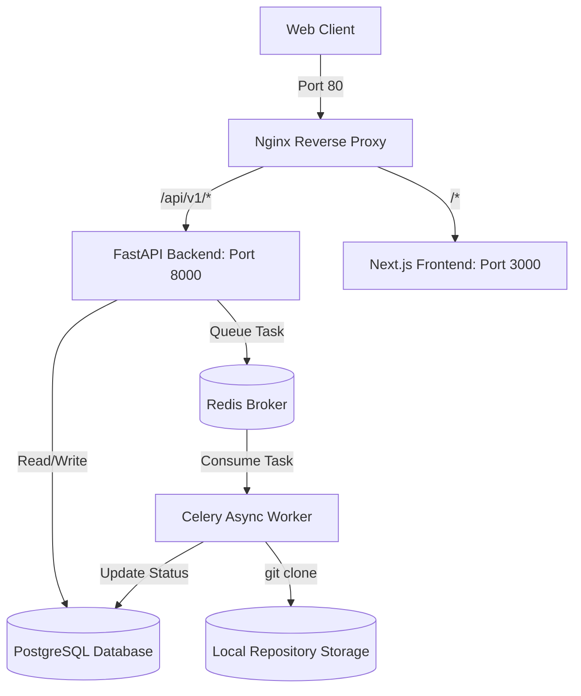
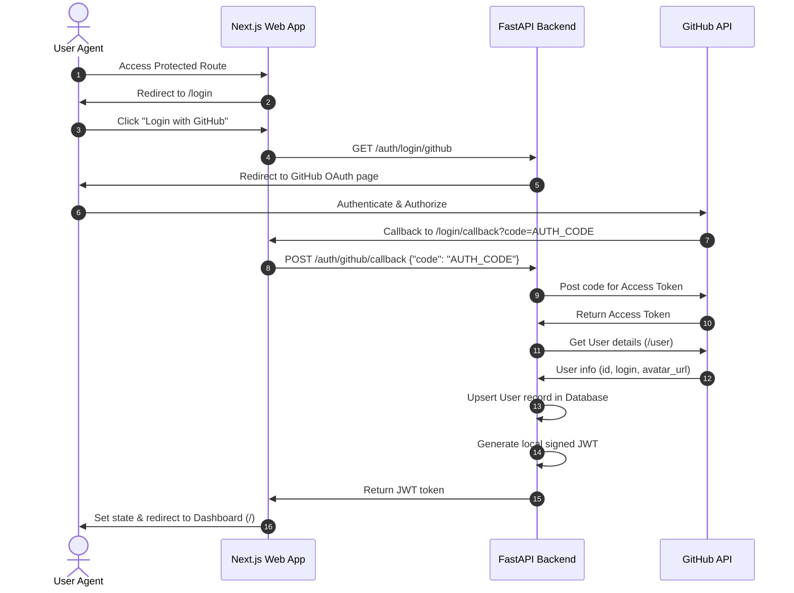
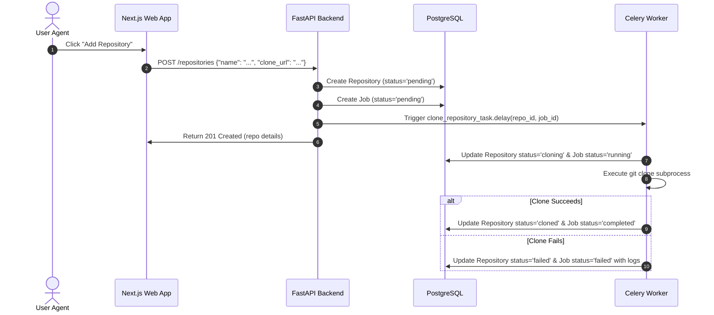

# CodeAtlas Architecture Guide

This document describes the high-level architecture, request lifecycle, data models, and background task queues of the CodeAtlas platform.

## Overview Flowchart

The following diagram maps how web client requests are proxied by Nginx to either the Next.js frontend or the FastAPI backend, and how tasks are queued via Redis to the Celery background worker:

---

## Authentication Flow (GitHub OAuth & JWT)

Secure sessions are managed by exchanging GitHub authorization codes for local signed JWTs:

---

## Asynchronous Git Cloning Lifecycle

Repository clones are executed out-of-band by workers using Celery:

